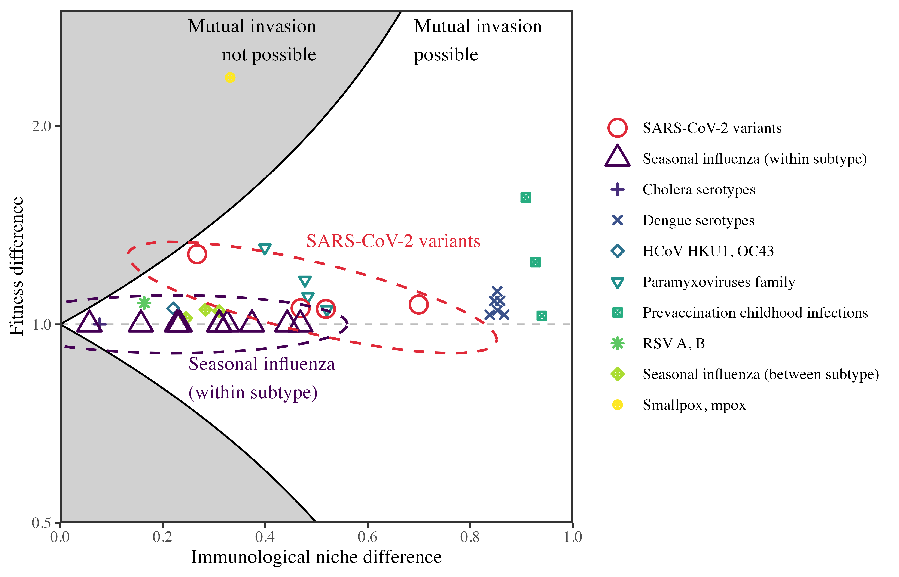
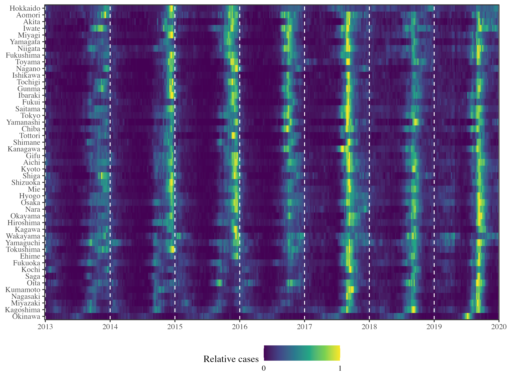

# Research

## Community ecology of infectious disease pathogens

Understanding what mechanisms determine species coexistence is a fundamental aim in community ecology. Analogously, we can ask how the host immune response shape competition between related pathogens strains and facilitate their coexistence at the population level. We are interested in studying infectious disease dynamics from the perspective of community ecology, where we aim to characterize the dynamics of a pathogen community as a whole, rather than focusing on individual pathogens. These efforts will allow us to predict future emergence and re-emergence opportunities.

* **Park, S.W.**, Cobey, S., Metcalf, C.J.E., Levine, J.M., and Grenfell, B.T., 2024. [Predicting pathogen mutual invasibility and co-circulation](https://www.science.org/doi/abs/10.1126/science.adq0072). *Science*, 386(6718), 175-179.

## Understanding the relationship between climate and disease transmission

There is increasing evidence that climate factors play critical roles in determining how well diseasese transmit. In some cases, such as the RSV epidemic in Japan, interplay between climate-driven transmission and changes in population-level immunity can lead to complex outbreak patterns. We seek to understand the relationship between climate and disease transmission, and further leverage these findings to predict the dynamics of pathogen communities in future climate.

* **Park, S.W.**, Holmdahl, I., Howerton, E., Yang, W., Baker, R.E., Vecchi, G.A., Cobey, S., Metcalf, C.J.E., Grenfell, B.T., 2025. [Interplay between climate, childhood mixing, and population-level susceptibility explains a sudden shift in RSV seasonality in Japan](https://www.medrxiv.org/content/10.1101/2025.03.02.25323095v1). *medRxiv*.

## Integrating serological and genomic data to improve epidemic inference and prediction

Traditional pathogen surveillance systems, such as symptom-based testing, only captures a small fraction of total infections and therefore provides limited information about the underlying disease transmission. This limitation can cause large uncertainties in our inferences and predictions about epidemic dynamics. Recently, we showed that integrating even a small amount of serological data can considerably improve our ability to predict future outbreaks of Enterovirus D68. Our goal is to further extend these approaches for antigenically variable pathogens, allowing integration of both serological and genomic data to predict pathogen evolution.

* Nguyen-Tran, H.§, **Park, S.W.**§, Vogt, M.R.§, Permaul, P.§, Spaulding, A.B., Hernandez, M.L., Bohl, J.A., Godbole, S., Ruckwardt, T.J., Krug, P.W., Moss, D.L., Derrien-Colemyn, A., Chowdhury, A., Dziubla, G., Wang, L., Castro, M., Narpala, S.R., Longtine, E.R., Henry, A.R., Ngo, T.-T.B., Dzantiev, L., Sigal, G.B., Metcalf, C.J.E., Kimberlin, D.W., Dominguez, S.R., Mittelman, A., McDermott, A.B., Serebryannyy, L.A., Grenfell, B., Messacar, K., and Douek, D.C., 2025. [Dynamics of endemic virus re-emergence in children in the USA following the COVID-19 pandemic (2022–23): a prospective, multicentre, longitudinal, immunoepidemiological surveillance study](https://www.thelancet.com/journals/laninf/article/PIIS1473-3099(25)00349-4/fulltext). *Lancet Infectious Diseases*.\
§Contributed equally.
* **Park, S.W.**, Messacar, K., Douek, D.C., Spaulding, A.B., Metcalf, C.J.E., and Grenfell, B. T., 2024. [Predicting the impact of COVID-19 non-pharmaceutical intervention on short-and medium-term dynamics of enterovirus D68 in the US](https://www.sciencedirect.com/science/article/pii/S1755436523000725). *Epidemics*, 46, 100736.
* **Park, S.W.**, Pons-Salort, M., Messacar, K., Cook, C., Meyers, L., Farrar, J., Grenfell, B.T., 2021. [Epidemiological dynamics of enterovirus D68 in the United States and implications for acute flaccid myelitis](https://www.science.org/doi/10.1126/scitranslmed.abd2400). *Science Translational Medicine*, 13(584): eabd2400.
